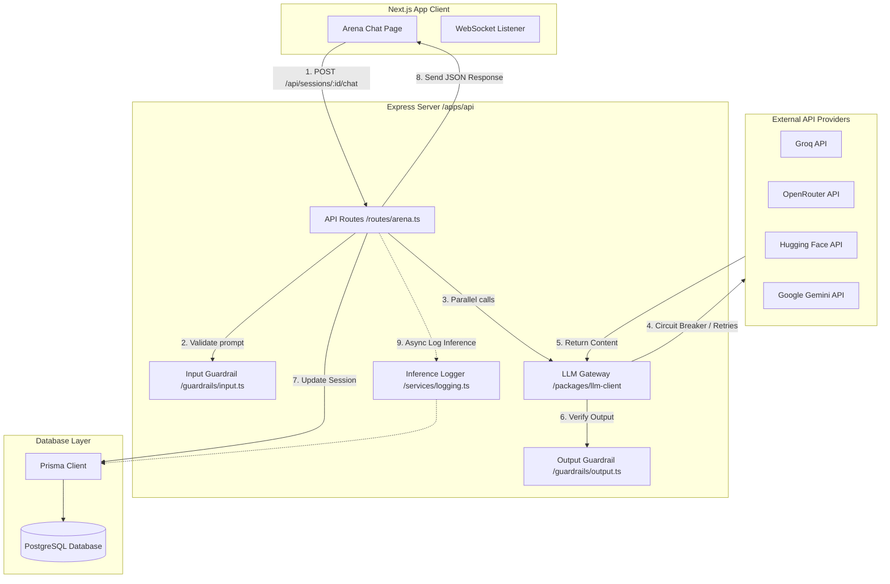
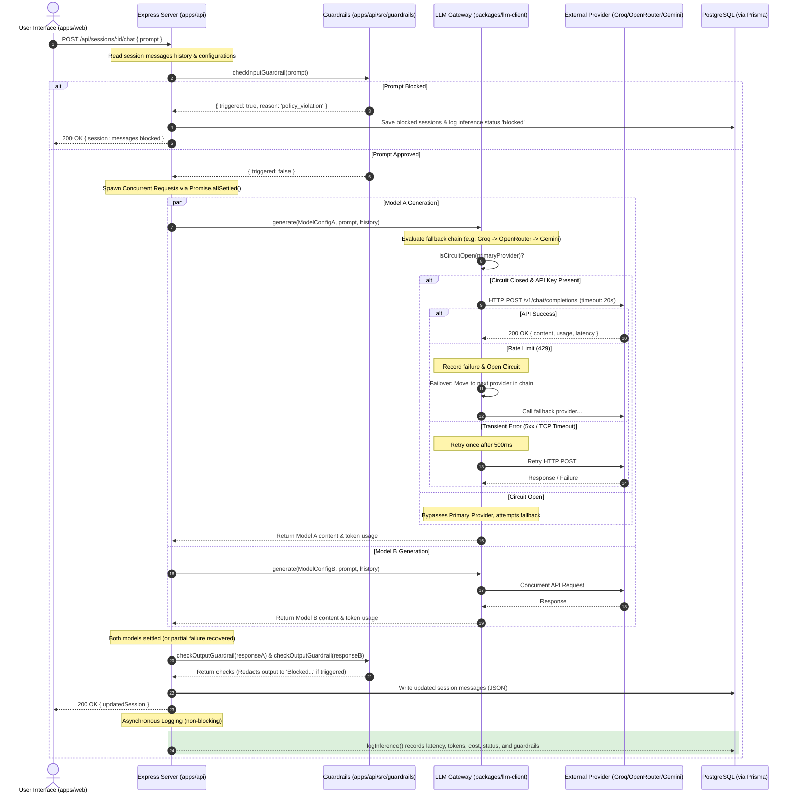

# ModelVerdict Architecture, Resilience & Interview Preparation Guide

This document contains a detailed analysis of the **ModelVerdict** system architecture, request-response workflows, resilience patterns, and interview preparation questions.

---

## 🏗️ 1. System Architecture & Directory Layout

ModelVerdict is structured as a TypeScript monorepo using **Turborepo** and **Bun** for high-performance package management and pipeline orchestration.

### Workspace Structure
*   **`apps/web`**: Next.js (App Router) single-page application built with React and Vanilla CSS. It connects to the API server via HTTP and WebSockets.
*   **`apps/api`**: Express.js server using Node HTTP, WebSockets (`ws`), and Prisma ORM connected to a PostgreSQL database.
*   **`packages/llm-client`**: Resilient gateway client interface for communicating with external LLM providers (Groq, OpenRouter, Hugging Face, Gemini API).
*   **`packages/evaluator`**: Automated judge prompting logic (`gemini-2.5-flash` at low temperature) and scoring rubrics.
*   **`packages/shared`**: Shared TypeScript interfaces, model catalogs (`MODEL_CATALOG`), prompt datasets, and types.

---

## 📊 2. Architectural Diagrams

### A. High-Level Request/Response Data Flow

This diagram shows how components communicate across application boundaries:



---

### B. End-to-End Request-Response Sequence Diagram

This sequence diagram traces the lifecycle of a single user prompt sent to the comparative Chat Arena, demonstrating concurrent compiling, guardrail filtering, and gateway failovers:



---

## 🛡️ 3. Key Resiliency & Architectural Patterns

### 1. Multi-Provider Fallback Gateway
To shield users from external API downtime, the system implements a **fault-tolerant proxy gateway**:
*   **Provider Fallback Chains**: Each model config in the shared package holds a `providerChain` representing backup endpoints (e.g., Groq $\to$ OpenRouter $\to$ HuggingFace $\to$ Gemini).
*   **Circuit Breaker**: If a provider fails $3$ times consecutively, its state is marked as "open" for $60$ seconds. Subsequent requests short-circuit and immediately try the next provider in the chain, eliminating unnecessary network waiting.
*   **Intelligent Retry Logic**:
    *   **Rate Limits (429)**: Skip the provider immediately and trip the circuit breaker (no retry).
    *   **Transient Errors (5xx, TCP timeout)**: Wait $500\text{ms}$ and retry once. If still failing, trip the circuit and move to the next provider.
*   **Connection Pooling**: Customized OpenAI clients use a keep-alive HTTPS agent (`keepAlive: true`, `maxSockets: 32`) to reuse sockets and optimize TCP/TLS handshake times.

### 2. Chronological Elo Stands Engine
Instead of storing mutable Elo ratings that can lead to drift or sync issues:
*   **Sequential Replay**: The server runs the Elo formula chronologically (`createdAt: asc`) over all database vote records starting from a baseline of `1200` (using $K = 32$).
*   **Moment-in-Time Deltas**: When a user submits a vote, the system evaluates the standings prior to that session's creation time to calculate and record the precise Elo changes (e.g. `+16 Elo` / `-15 Elo`) for that session.

### 3. Asynchronous Benchmarking (LLM-as-a-Judge)
*   **Background Workers**: Running evaluation batches triggers a detached promise function. Progress is broadcasted to clients in real-time via WebSockets (`/ws`), preventing long-running API calls from dropping HTTP connections.
*   **Deterministic Judge Prompting**: The system utilizes `gemini-2.5-flash` at a deterministic temperature of `0.1` and a JSON response schema to rate factual correctness, bias, and jailbreak refusals.

---

## 📝 4. Technical Practice Interview Questions & Answers

### Q1: How does the Gateway's Circuit Breaker protect downstream resources, and why is rate-limiting handled differently than a server-side 500 error?
**Answer:**
The circuit breaker keeps a map of provider states (failures and last failed time). If a provider triggers 3 consecutive failures, the circuit opens, and subsequent requests bypass this provider for 60 seconds, saving API request credits and user latency.
Rate limits (429) signify quota exhaustion; retrying immediately will always fail and prolong latency. Therefore, the gateway skips retries on 429s and jumps to the next fallback provider. Transient 5xx errors (like temporary server hiccups) are retried once after a 500ms delay as they are highly likely to recover immediately.

---

### Q2: In `gateway.ts`, we use `Promise.race` for enforcing timeouts on individual provider calls. What is a hidden resource leak danger of using `Promise.race` in Node.js, and how would you fix it?
**Answer:**
`Promise.race` only resolves or rejects when the *first* promise settles. The slower, losing promise (the API call) is **not aborted** and continues to execute in the background. If a provider server hangs, the socket connection remains active until it hits standard system socket timeouts (which can be several minutes). This can lead to socket exhaustion, clogging Node.js thread pools under high concurrency.
**Fix:** Pass an `AbortSignal` (via `AbortController`) to the HTTP client (Axios/Fetch/OpenAI) and call `abort()` programmatic when the timeout triggers.

---

### Q3: Why configure a custom `https.Agent` with `keepAlive: true` and `maxSockets: 32` in the OpenAI client build process?
**Answer:**
By default, Node.js HTTP agents destroy sockets after each request, meaning subsequent API calls require a new TCP 3-way handshake and TLS negotiation (costing 100ms–300ms of latency). Enabling `keepAlive: true` keeps the sockets open for reuse. Limiting `maxSockets` to 32 guarantees that the server does not overload downstream providers or crash local socket bounds under heavy concurrency.

---

### Q4: The Elo calculation engine in `leaderboard.ts` replays all historical votes in memory. What are the scaling implications of this approach as the database grows to millions of votes, and how would you optimize it?
**Answer:**
Fetching and sorting millions of rows in memory on every request creates massive database I/O, CPU, and RAM bottlenecks, eventually causing Out Of Memory (OOM) crashes.
**Optimizations:**
1.  **State Materialization**: Cache the current Elo scores in a dedicated table or Redis cache.
2.  **Event-Driven Updates**: When a vote is cast, trigger an event listener that reads the current scores from the cache, calculates the delta, updates the cache, and logs the historical delta in PostgreSQL for audit trails.
3.  **Batch Jobs**: If recalculations are needed, run them via offline background cron tasks during off-peak hours instead of on page-load.

---

### Q5: In the `/chat` route within `arena.ts`, we use `Promise.allSettled` instead of `Promise.all`. Why is this design choice critical for a comparative Chat Arena?
**Answer:**
`Promise.all` is fail-fast; if either Model A or Model B throws an error (e.g., rate limit, timeout, parser crash), the entire call fails and returns a `500` to the client. By using `Promise.allSettled`, the route recovers from partial failures. If Model A fails but Model B succeeds, the client receives Model B's output along with a clean error message in place of Model A. This allows the user to still view the functioning model's output and submit a vote.

---

### Q6: In the background worker logic inside `evaluation.ts`, what happens if the API server crashes midway through a 35-prompt benchmark run? How would you redesign this to be durable?
**Answer:**
Because active evaluation tasks are tracked in an in-memory Map (`activeRuns`) and triggered inside an un-awaited background process, a server crash would lose all progress, and the database status of the run would remain stuck at `running` indefinitely.
**Durable Redesign:** Use a persistent task queue manager like **BullMQ** (backed by Redis) or **temporal.io**. Each prompt evaluation step is queued as a separate job. If a worker server crashes, another node in the cluster grabs the remaining jobs from Redis, allowing the evaluation to recover and resume from the last successful prompt.

---

### Q7: Explain the security and UX implications of input guardrails versus output guardrails. How do their execution paths differ in terms of API resource costs?
**Answer:**
*   **Input Guardrails**: Run *before* hitting the LLMs. They prevent prompt injections and jailbreaks, protecting the LLM backend. If triggered, they block the request immediately, costing $0$ in LLM tokens and incurring negligible latency ($<50\text{ms}$).
*   **Output Guardrails**: Run *after* LLMs generate response content. They prevent the user from seeing harmful or illegal model outputs. However, because the LLM has already completed the request, the system incurs full downstream API billing (both input and output tokens) and latency costs (seconds of execution time).

---

### Q8: In `judge.ts`, we instruct Gemini to return a raw JSON response. Why is temperature set to `0.1`? What fallback parsing techniques are used to ensure system stability?
**Answer:**
*   **Temperature (0.1)**: Minimizes randomness, encouraging the LLM to output highly deterministic scores based strictly on the provided rubrics.
*   **Parsing Fallbacks**: LLMs sometimes wrap JSON outputs in markdown blocks (` ```json ... ``` `) despite system instructions. The system uses a regex/string-replace cleanup block to sanitize these wrappers before calling `JSON.parse`. If parsing still fails (e.g. malformed JSON), a `try/catch` block prevents a system crash by returning a default neutral score (`5/10` values) with a logged warning.

---

### Q9: Since this project is organized as a Turborepo, how can you configure the `turbo.json` file to speed up your CI/CD pipelines (such as linting, testing, and building)?
**Answer:**
Turborepo leverages local and remote caching. By defining task pipelines in `turbo.json` and declaring target files (e.g., `dist/**`, `next/**`) and file inputs (e.g., `src/**/*`), Turbo hashes package dependencies and code contents. In a CI pipeline, if `packages/shared` has not changed, running `turbo run build` or `turbo run test` will retrieve the build outputs directly from cache in milliseconds rather than rebuilding from scratch.

---

### Q10: Explain how WebSocket broadcasts in `websocket.ts` are scoped. What would happen if multiple users initiated a benchmark run at the same time? How would you implement "multitenancy" for evaluation status events?
**Answer:**
Currently, WebSocket events are broadcasted globally (`wss.clients.forEach`). If User A and User B launch runs simultaneously, their screens will overwrite each other with mixed progress metrics.
**Multitenancy Implementation:** 
Implement room/channel subscriptions. When a browser connects to the WebSocket, it should send a subscription payload containing the specific `runId` (e.g. `{ action: 'subscribe', runId: 'run-xxx' }`). The server maps client sockets to their subscribed `runIds`. When broadcasting, the server filters client connections and only sends progress packets to sockets subscribed to that specific `runId`.
